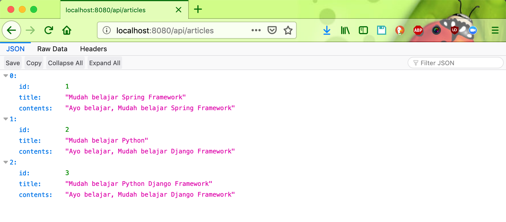

# springboot-kotlin-article

### Things to do to run locally:
#### Clone repository:
```
git clone https://github.com/hendisantika/springboot-kotlin-article.git
```

#### Go to the folder
```
cd springboot-kotlin-article
```

#### Run the app
```
gradle clean bootRun --info
```

#### Login Username account
|#|Username|Password|
|---|---|---|
|1|naruto|naruto|
|2|sasuke|sasuke|

### Screen shot

#### Login Page


#### Home Page


#### Add New Article


#### List Article



#### Search Page


#### Find Page 

